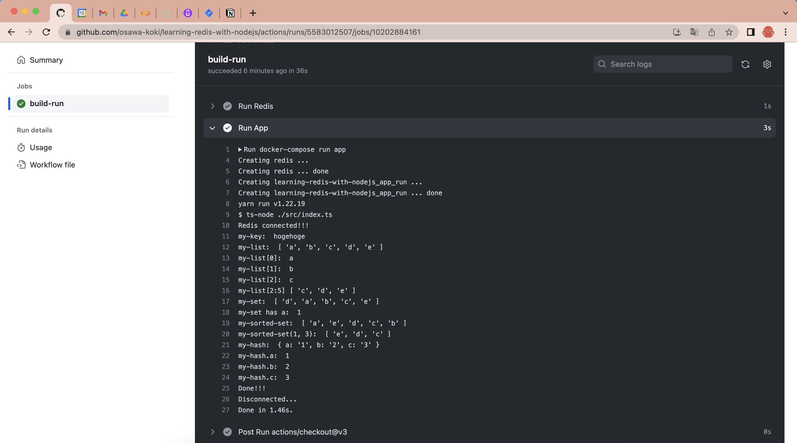

# learning-redis-with-nodejs

🤡🤡🤡 Node.jsでRedisを操作してみる！  

  

## 開発環境の構築

```shell
docker-compose build
docker-compose run -d --rm --name learning-redis-with-nodejs-redis redis
docker-compose run -it --rm --name learning-redis-with-nodejs-app app
```
